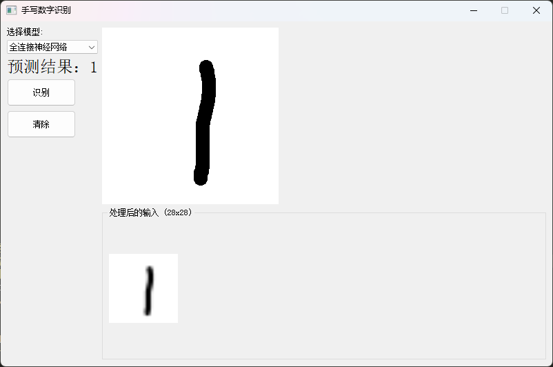
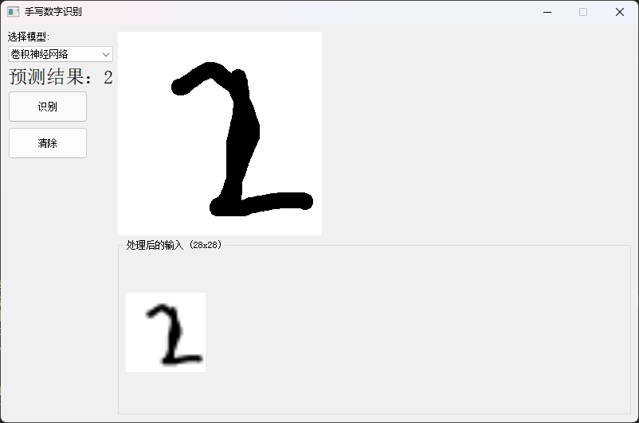

# 基于pytorch的手写数字识别

| 配置               | 内容                                                            |
| ------------------ | --------------------------------------------------------------- |
| **数据集**   | MNIST数据集，共7万张手写数字图片                                |
| **运行环境** | Python3.9 torch2.5.1 cuda12.1 PyQT5等详情见requirements.txt文件 |

## 安装依赖

```bash
pip install -r ./requirements.txt
```

注意：若要使用Cuda显卡并行加速训练，需要额外安装Cuda，本机采用12.1

同时安装torch包要按照GPU版本，否则无法使用Cuda进行并行加速训练。

安装Cuda过程可参考[英伟达DUDA12.1在Windows11环境下配置CUDAToolkit教程](https://blog.csdn.net/zr2006_7/article/details/130668902)

同时安装GPU版本的torch包，则可使用如下命令进行安装：

```
pip install torch==2.5.1+cu121 -f https://mirrors.aliyun.com/pytorch-wheels/cu121
```

## 文件结构

`main.py`为**全连接神经网络**模型识别手写数字训练代码

`cnn_mnist.py`为**卷积神经网络**模型识别手写数字训练代码

修改主函数main()中的range参数，可调整训练轮次

```python
for epoch in range(10) # 训练轮次为10轮
```

`gui.py`为测试两种模型效果的GUI程序

使用效果如下：





注意：每次识别间隔不能过快，否则程序可能导致图像缓存还未清理完全就识别的情况发生，从而导致识别错误。

若出现问题，多次按清除按钮即可。或者退出程序，重新打开。

`draw.py`绘制出卷积神经网络结构图
